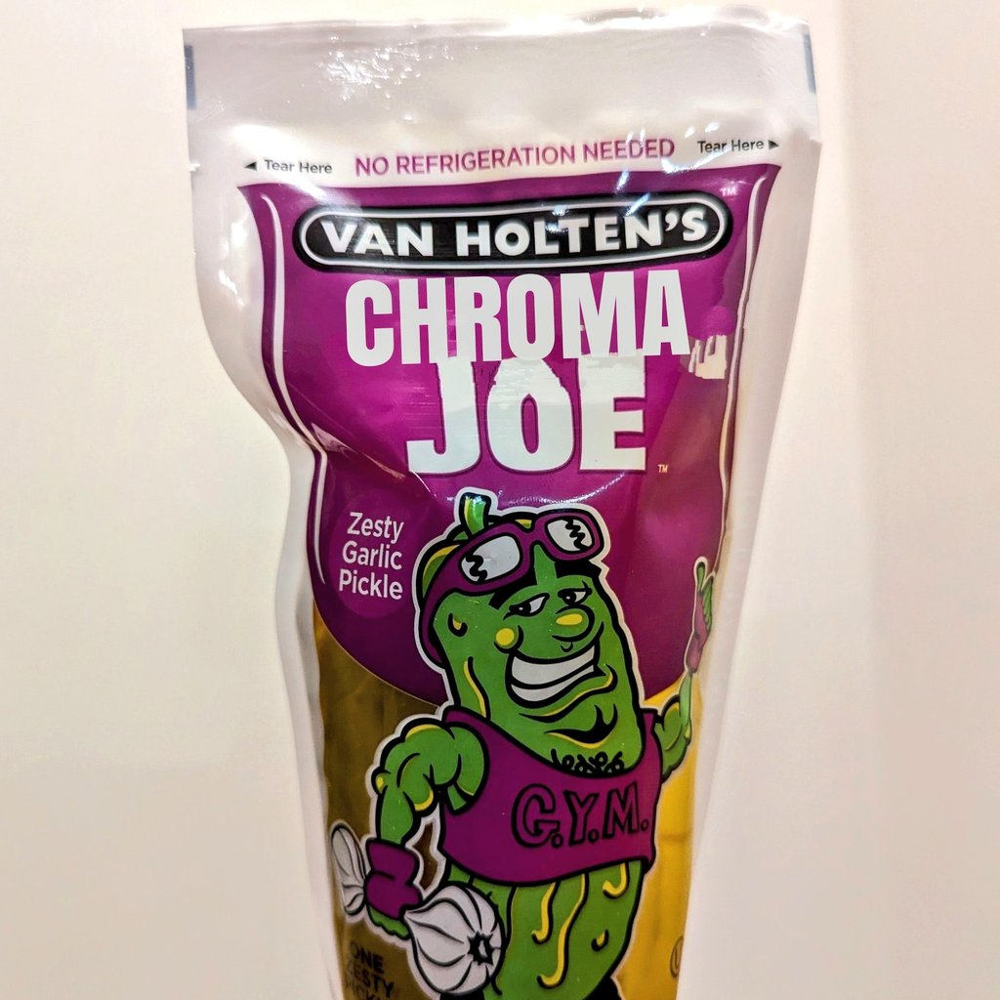

# chroma-cumber
the official chroma pickle wrapper

after working on [chroma](https://github.com/chroma-core/chroma) for several months now, 
the team has come to the realization that everything we were doing was
far too complicated for the task at hand 

embeddings? filtering? approximate nearest neighbor with iterative updates? 

no! far too complicated! 

what users really needed is a simple lightweight wrapper around a pickle.

chroma-cumber is that wrapper.  you're welcome. 

